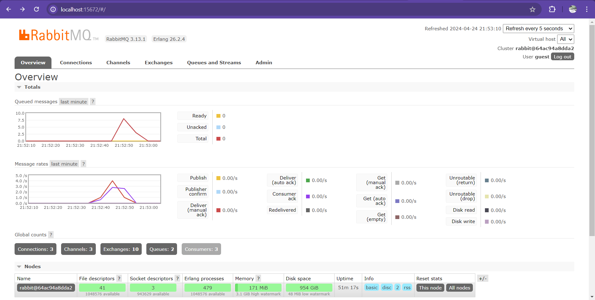
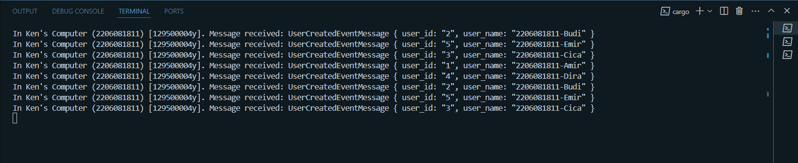
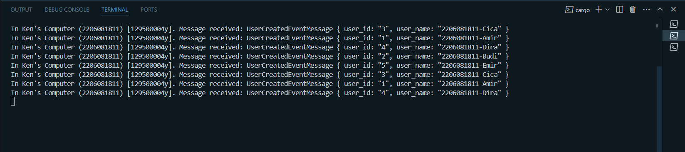
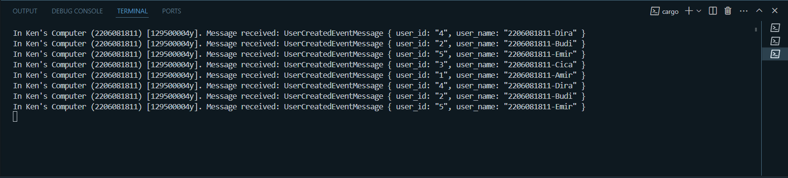

# subscriber

Reflection 1:
    a. AMQP (Advanced Message Queuing Protocol) is a standardized messaging protocol designed for efficient and reliable message transmission between applications or systems. It facilitates asynchronous communication by defining a common format for messages and providing features like queuing, routing, and message acknowledgement.
    b. "guest" represents the username for authentication, and "guest" again represents the password. "localhost:5672" specifies the hostname (localhost) and port number (5672) where the AMQP service is running, indicating the address for connecting to the message broker.

Subscriber making connection to RabbitMQ:

Simulating Slow Respond:

The total number of queues in the graph is 15 because we added the code thread::sleep(ten_millis), which pause the execution of the current thread for a specified amount of time. Therefore the execution of a message given by publisher is paused by 10 ms which may increase the number of messages to be put in the waiting list because they can't be executed unless the program waited for 10 ms after each execution.

Simulating slow respon with multiple console:

Notice that the number of queues in the graph reduced down to 8 queues whilst the number of cargo run I made in this case is 7 (before was only 4). This may happen due to the subscriber program ran by 3 consoles. So basically the messages from publisher that were put in the queue was served by 3 servers rather than 1, so the task will most likely be done faster, which will reduce the spike quicker. The only thing I can suggest to improve the code in terms of Software Archtiecture is to delete thread::sleep(ten_millis), that part can only be used for demostration and musn't be used in production environment.
Here are the images of tasks received by each consoles:
1. 

2. 

3.
