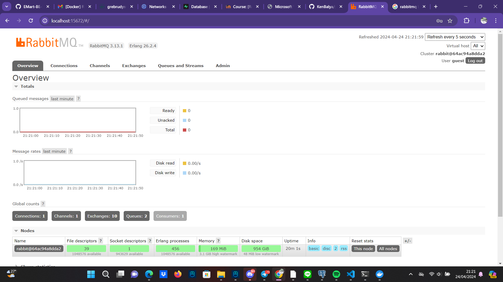
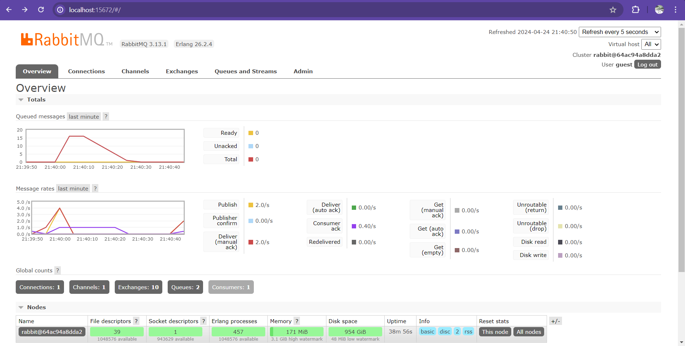

# subscriber

Reflection 1:
    a. AMQP (Advanced Message Queuing Protocol) is a standardized messaging protocol designed for efficient and reliable message transmission between applications or systems. It facilitates asynchronous communication by defining a common format for messages and providing features like queuing, routing, and message acknowledgement.
    b. "guest" represents the username for authentication, and "guest" again represents the password. "localhost:5672" specifies the hostname (localhost) and port number (5672) where the AMQP service is running, indicating the address for connecting to the message broker.

Subscriber making connection to RabbitMQ:

Simulating Slow Respond:

The total number of queues in the graph is 15 because we added the code thread::sleep(ten_millis), which pause the execution of the current thread for a specified amount of time. Therefore the execution of a message given by publisher is paused by 10 ms which may increase the number of messages to be put in the waiting list because they can't be executed unless the program waited for 10 ms after each execution.